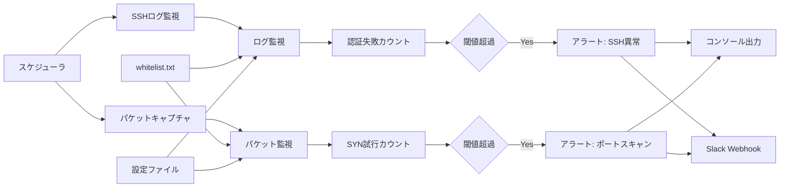

# セキュリティ監視ツール

リアルタイムでSSHログイン異常とポートスキャンを検知し、Slackへアラート通知を行うセキュリティ監視ツールです。

## アーキテクチャ図



## 機能

### SSH監視機能
- `/var/log/auth.log`（Debian系）または`/var/log/secure`（RedHat系）をリアルタイム監視
- 失敗ログインパターンの検出
- IP別の失敗回数カウントと閾値監視
- 時間窓での制限（デフォルト60秒）

### パケット監視機能
- 全ネットワークインターフェースのTCP SYNパケットをキャプチャ
- ポートスキャン検出（同一IPからの大量SYN試行）
- 低リソース使用でリアルタイム処理

### アラート機能
- コンソールへの色付きアラート表示
- Slack Webhook経由でのリアルタイム通知
- 攻撃タイプ別のメッセージフォーマット

### ホワイトリスト機能
- IP/CIDR形式での除外設定
- 動的ファイル更新検知
- デフォルトで内部ネットワークを除外

## 必要な環境

- Python 3.9以上
- Linux系OS（Debian/Ubuntu/CentOS/RHEL対応）
- パケットキャプチャ権限（root または CAP_NET_RAW）
- メモリ 50MB以上

## インストール

### 1. リポジトリクローン
```bash
git clone <repository-url>
cd security-monitor
```

### 2. 依存関係インストール
```bash
pip install -r requirements.txt
```

### 3. 権限設定（パケット監視用）
```bash
# Pythonバイナリに権限付与
sudo setcap cap_net_raw,cap_net_admin+ep $(which python3)

# または管理者権限で実行
sudo python3 security_monitor.py
```

### 4. 環境設定
```bash
cp .env.example .env
```

`.env`ファイルを編集して設定：
```bash
# 必要に応じて調整
SSH_THRESHOLD=5
PACKET_THRESHOLD=100
TIME_WINDOW=60

# Slack通知（オプション）
SLACK_WEBHOOK_URL=https://hooks.slack.com/services/YOUR/WEBHOOK/URL
```

### 5. ホワイトリスト設定
`whitelist.txt`を編集して除外IPを設定：
```
# 社内ネットワーク
192.168.1.0/24
10.0.0.0/8

# 管理サーバー
203.0.113.10
```

## 使用方法

### 基本実行
```bash
python3 security_monitor.py
```

### オプション指定
```bash
# SSH監視のみ
python3 security_monitor.py --no-packet

# パケット監視のみ
python3 security_monitor.py --no-ssh

# 特定インターフェース監視
python3 security_monitor.py --interface eth0

# 閾値変更
python3 security_monitor.py --ssh-threshold 10 --packet-threshold 200

# 詳細ログ出力
python3 security_monitor.py --verbose
```

### デーモンモード（バックグラウンド実行）
```bash
python3 security_monitor.py --daemon
```

### システムサービス化（systemd）
`/etc/systemd/system/security-monitor.service`を作成：
```ini
[Unit]
Description=Security Monitor
After=network.target

[Service]
Type=simple
User=security-monitor
WorkingDirectory=/opt/security-monitor
ExecStart=/usr/bin/python3 security_monitor.py
Restart=always
RestartSec=5

[Install]
WantedBy=multi-user.target
```

サービス有効化：
```bash
sudo systemctl daemon-reload
sudo systemctl enable security-monitor
sudo systemctl start security-monitor
```

## 設定項目

### 環境変数
| 変数名 | デフォルト | 説明 |
|--------|------------|------|
| SSH_THRESHOLD | 5 | SSH失敗ログイン閾値 |
| PACKET_THRESHOLD | 100 | SYN試行閾値 |
| TIME_WINDOW | 60 | 監視時間窓（秒） |
| PACKET_INTERFACE | any | 監視インターフェース |
| WHITELIST_FILE | whitelist.txt | ホワイトリストファイル |
| SLACK_WEBHOOK_URL | - | Slack通知URL |
| LOG_LEVEL | INFO | ログレベル |

### コマンドラインオプション
```
--config, -c        設定ファイルパス
--ssh-log          SSHログファイルパス
--ssh-threshold    SSH失敗閾値
--packet-threshold パケット閾値
--interface, -i    ネットワークインターフェース
--window, -w       時間窓（秒）
--whitelist        ホワイトリストファイル
--no-ssh           SSH監視無効
--no-packet        パケット監視無効
--daemon, -d       デーモンモード
--verbose, -v      詳細ログ
```

## アラート例

### SSH攻撃検出
```
[SSH ATTACK] 2025-08-16T08:59:00
SSH Brute Force Attack Detected!
Source IP: 203.0.113.100
Failed attempts: 12 (threshold: 5)
Time window: 60 seconds
Recommended action: Block IP 203.0.113.100 in firewall
```

### ポートスキャン検出
```
[PORT SCAN] 2025-08-16T09:00:00
Port Scan Activity Detected!
Source IP: 198.51.100.50
SYN attempts: 150 (threshold: 100)
Unique ports scanned: 25
Target IPs: 1
Sample ports: 22, 23, 25, 53, 80, 135, 139, 443, 445, 993
Recommended action: Block IP 198.51.100.50 in firewall
```

## 監視パターン

### SSH監視対象
- `Failed password for [user] from [IP]`
- `Invalid user [user] from [IP]`
- `authentication failure.*rhost=[IP]`
- `maximum authentication attempts exceeded.*from [IP]`

### パケット監視
- TCP SYNパケット（フラグ: SYN=1, ACK=0）
- 全ポートへの接続試行
- IP別カウントと閾値判定

## トラブルシューティング

### 権限エラー
```
Error: Operation not permitted
```
**解決方法：**
```bash
sudo setcap cap_net_raw,cap_net_admin+ep $(which python3)
```

### ログファイルが見つからない
```
Error: SSH log file not found: /var/log/auth.log
```
**解決方法：**
```bash
# システムに応じてパス指定
python3 security_monitor.py --ssh-log /var/log/secure  # RHEL/CentOS
python3 security_monitor.py --ssh-log /var/log/messages  # その他
```

### Slack通知が届かない
**確認点：**
1. Webhook URLが正しいか
2. インターネット接続があるか
3. Slackワークスペースの設定

### 高いCPU使用率
**対策：**
1. 閾値を上げる（誤検知減少）
2. 時間窓を短縮
3. 特定インターフェースのみ監視

## パフォーマンス

### リソース使用量
- **メモリ**: 30-50MB
- **CPU**: 3-8%（通常時）
- **ディスク**: ログファイルサイズ依存

### スケーラビリティ
- 同時監視IP数: 10,000以上
- パケット処理能力: 1,000 pps
- アラート応答時間: 1-5秒

## セキュリティ考慮事項

### 権限管理
- 最小権限の原則に従って実行
- 専用ユーザーでの実行を推奨
- ログファイルへの読み取り権限のみ必要

### 機密情報
- `.env`ファイルの権限制限（600）
- Slack Webhook URLの適切な管理
- ログファイルへの不正アクセス防止

## ライセンス

MIT License

## 貢献

1. Forkする
2. フィーチャーブランチを作成
3. 変更をコミット
4. プルリクエストを送信

## サポート

- GitHub Issues
- セキュリティ脆弱性: security@example.com

## 更新履歴

### v1.0.0
- 初期リリース
- SSH監視機能
- パケット監視機能
- Slack通知機能
- ホワイトリスト機能